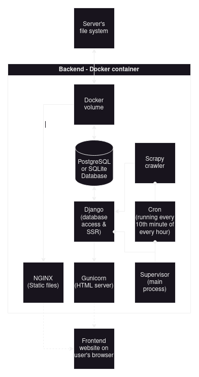

# Homeowner.cz
Homeowner.cz is a lite full-stack scraped data web app for displaying listed flats for sale from [sreality.cz](https://www.sreality.cz/en/search/for-sale/apartments).
The stack is made of a webpage, periodically run scraper, backend and a database. It's mostly written in Python, containerized with Docker and *attempts* to be production ready.

## WARNING - READ THIS BEFORE USING!

Scraping a lot of items creates a big load on the target site, ***please use this app responsibly by not abusing the target site; thanks!*** You also run the risk of the target site banning you - or rather your IP.

Keep in mind that the scraping load on your PC is quite high, as my PC crashed after scraping 320 consecutive items.

## Why this exists

This project was only created as a test for making a full-stack scraping application almost entirely in Python. Scraper supports scraping dynamic sites such as [sreality.cz](https://www.sreality.cz/en/search/for-sale/apartments), meaning, only a blank HTML page is loaded at first and then populated using Javascript, typically with one of the popular frameworks such as [Angular](https://angular.io/).

## Architecture

For scraping, [Scrapy](https://scrapy.org/) is used together with [Playwright](https://playwright.dev/) which allows scraping dynamic sites.

As the backend framework, [Django](https://www.djangoproject.com/) was selected, as it's made with a [similar design philosophy](https://docs.scrapy.org/en/latest/faq.html#did-scrapy-steal-x-from-django) as Scrapy and allows very easy SSR (Server-Side Rendering) of webpages with data population directly from the database.

Data is stored in either a PostgreSQL or a SQLite database, [depending on which environment the app is run in](#environments).

The scraping process is ran when starting the application and after that periodically, every 10-th minute in every hour, which is controlled by a [Cron job](https://en.wikipedia.org/wiki/Cron).

Web serving is done through [Gunicorn WSGI](https://gunicorn.org/) for HTTP requests and [NGINX](https://www.nginx.com/) for static files.

Backend and scraper processes are controlled by [Supervisor](http://supervisord.org/).

The stack's architecture is displayed in a diagram below.


## Requirements

The application is intended to be run with [Docker](https://www.docker.com/).
If you don't have Docker installed, you can find instructions on how to do so [here](https://docs.docker.com/engine/install/).

If you don't wish to install Docker, it's still possible to run, but much more tricky then with a [single command](#how-to-run). Anyway, I assume you know what you are doing if you decide to go this route. The key is that you need [Python 3.8](https://www.python.org/downloads/release/python-3817/).

## Settings

The Scraper has a few options:
| Settings | Default value | Description |
| -------- | ------------- | ----------- |
| `domain` | https://www.sreality.cz | Domain of the page to scrape |
| `rel_url` | [/en/search/for-sale/apartments/](https://www.sreality.cz/en/search/for-sale/apartments) | Relative URL to domain to scrape |
| `scrape_limit` | 500 | How many properties to scrape |

These settings can be modified in the [Django's Scrapy run command](/backend/homeownercz/management/commands/scrapy.py), by adding the above settings to the command as arguments:
```py
class Command(BaseCommand):
    help = 'Release the spiders'

    def handle(self, *args, **options):
        # Run the Scrapy property crawler once
        process = CrawlerProcess(get_project_settings())
        process.crawl(
            'property',
            rel_url='/en/search/for-sale/houses',
            scrape_limit=10
        )
        process.start()
```

## Environments

The application can be run in two environments:
- **Development**
- **Production**

The main difference being that the Development environment stores data in a local SQLite database, while the production environment spins up a PostgreSQL database.
Apart from that, the production environment forces stricter rules for security reasons and adjust settings (limits logs for example) to make running the app feasible in a production environment.

## How to run

**Development mode**
> First,  make sure you are located in the project's root directory, then simply type: `docker compose up`

**Production mode**
> Same as development, but make sure to specify the the production docker compose file as such: `docker compose -f docker-compose.prod.yaml up`

After docker images are built and containers are running, the webpage will be accessible on URLs `localhost` or `localhost:8080`.

## Known issues and limitations

- Currently, running in development environment (`docker compose up`) won't work, as the database settings are hardcoded to PostgreSQL, because of a Django bug that prevents setting the database engine from an environment variable. Please only run the app in production mode with `docker compose -f docker-compose.prod.yaml up`, until this is resolved.
- PostgreSQL was set to allow connections from all users which isn't appropriate for a production environment. This was done because Supervisor runs the scraper in it's own way that makes it not easy to connect to PostgreSQL. Most likely this could be easily resolved, but I didn't yet have time to look into it. 
- This app can't be used for scraping large data sets. The performance is not the priority here, but rather the simplicity and lean design.
